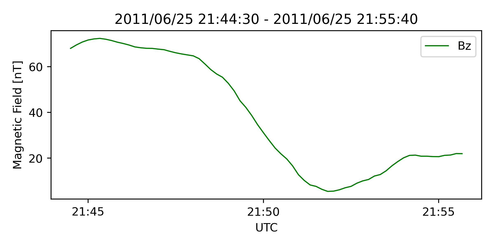
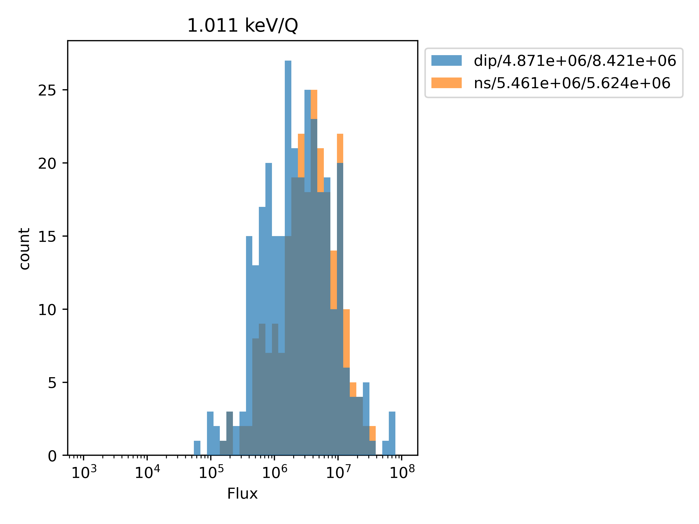
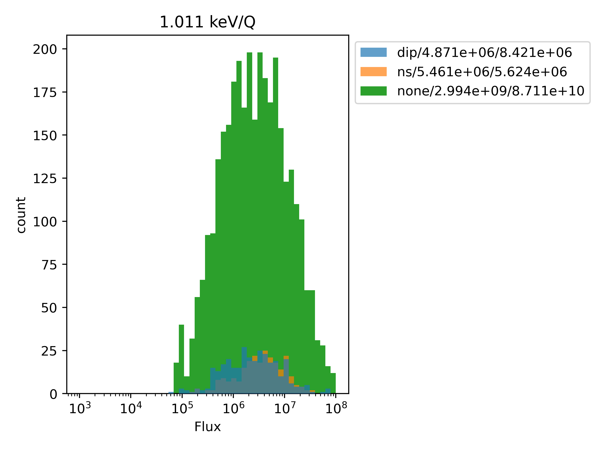
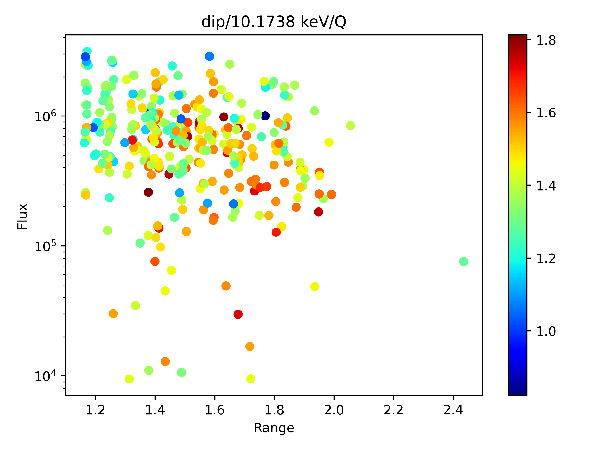
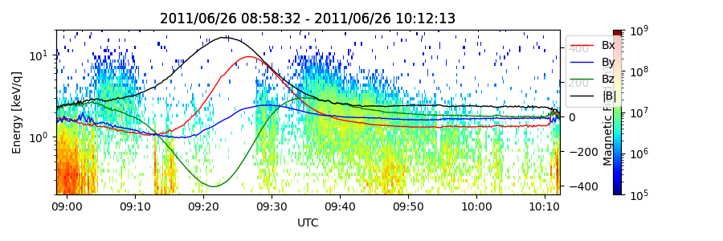

# 研究ノート
## 目次
- [目次](#目次)
- [関連ファイル](#関連ファイル)
- [2024/08/25](#20240825)
- [2024/08/27](#20240827)
- [2024/08/28](#20240828)
- [2024/09/09](#20240909)
- [2024/09/20](#20240920)
- [2024/09/27](#20240927)

## 関連ファイル
* __MDUS__  
    MESSENGERのデータ利用を容易にするツール     
    ```https://github.com/streamamz/MDUS.git```
* 

## 2024/08/25
### 研究内容
進捗無し
### 作業概要
* 環境構築を行った
  * __MDUS__ モジュールのGitHubへのアップロード
  * __Research__ リポジトリの作成
### 作業ファイル
* __MDUS__ モジュール   
  データ読み込み用のモジュールをMDUSに一本化

## 2024/08/27
### 研究内容
dipタイプとtail currentタイプの違いが何によるのかの考察中   
とりあえずdipタイプについて，199（dipあり）と200（dipなし）の比較をしてみる   
その最中にMDUSの修正を行った
### 作業内容
* 200（dipなし）において，磁気赤道近辺での磁場成分の様子を確認する準備を行った
* MDUSモジュールを研究用にアップデートした
### 今後の予定
* dipタイプ，tail currentタイプともに磁気赤道近辺での磁場成分の様子の比較
  * tail currentタイプの，条件が近くdepressionがないものを見つける
  * Bz成分の変化の比較方法の考案
    * 単純に全体の時間変動だけではうまい定義ではない
* 連続してdipが確認されたときのRssを抽出して比較
  * Rssを使うべきかDistIndexを使うべきかの議論
    * DistIndexが近似式では不十分？
* MDUSのアップデート
  * データ解析用のツール開発
    * MLAT計算用ツールや時間平均計算用ツールなど
### 作業ファイル
* __MDUS__ モジュール   
  * dataファイルが使用しやすいように変更
  * 座標をRmで規格化できるように変更
* __TypeClassification__
  * 磁場成分からのdip生成の要因を考察するために利用
* __DataShaping__
  * dataファイルをpickle形式に書き換えるために利用
* __ModuleDevelop__
  * __MDUS__ 開発状況の確認に利用
  
## 2024/08/28
### 研究内容
dipタイプについてある場合とない場合についての比較を行った   
dipありとして199，52，なしとして200，54を利用
* 磁場最大値
  * 199 (dipあり) : 72.3
  * 200 (dipなし) : 107
  * 52 (dipあり) : 90.4
  * 54 (dipなし) : 86.2
* 磁場最小値
  * 199 (dipあり) : 5.49
  * 200 (dipなし) : 44.2
  * 52 (dipあり) : 15.9
  * 54 (dipなし) : 24.9
  
各タイプの図は以下の通り
<figure>


</figure>
<figure>


</figure>

tail currentタイプについてある場合とない場合についての比較を行った
dipありとして2048，なしとして2047を利用
* 磁場最大値
  * 2048 (tcなし) : 20.4
  * 2047 (tcなし) : 28.5
* 磁場最小値
  * 2048 (tcなし) : 3.90
  * 2047 (tcなし) : 23.7

それぞれ以下の通り

<figure>


</figure>

→磁場の最大値・最小値の比較は（特に窪み無しが）領域に依存するので意味がない   
時間変動で考える

磁場最大値から磁場最小値への変動の時間依存，磁場最小値が領域のどのあたりで起きるのかを比較してみる

dipタイプについて
| |時間変動（nt/sec） | 秒数 (sec) |
|---|---|---|
|52 (dipあり)|-0.166|450|
|54 (dipなし)|-0.102|600|
|199 (dipあり)|-0.171|390|
|200 (dipなし)|-0.118|530|

tcタイプについて
| |時間変動（nt/sec） | 秒数 (sec) |
|---|---|---|
|2048 (tcあり)|-0.0359|460|
|2047 (tcなし)|-0.0115|420|

図からもわかることだが，dipタイプはdipありとなしでBz成分の変化の様子が大きく異なっている    
その様子が時間変動・継続時間にも表れている

一方のtcタイプは，図からもわかることだが，Bzの変化の様子は大きくは異なっていなさそう？    
時間変動と秒数にも表れていそうだが，時間変動はそもそものBzの大きさにも依存するため，何らかの規格化しなければ比較にならなそう？

数値的に特徴を表すための工夫が必要

そもそもtcタイプの抽出が甘すぎるため，修正したい
←モデルを使えるように実装する必要あり

### 作業内容
* 各タイプに対して，窪みを抽出したものとそうでないものの比較を行った
* MDUSモジュールに研究用のアップデートを行った
### 今後の予定
* MDUSにモデル磁場計算用のツールを追加する
* Bz成分の評価の再考
  * その他の成分についても同様に見てみる
* 主にdipタイプにたいして，連続で生じているものを抽出してみる
* 新しく窪みの抽出方法を考案する
### 作業ファイル
* __MDUS__ モジュール
  * データ解析用のサブモジュール __Analysis__ を追加
* __TypeClassification__
  * 先述の作業を行うコードを記述
* __figure__
  * 複数ファイルを追加
  
## 2024/09/09
### 研究内容
粒子データを用いた研究をスタートさせる    
とりあえずdiamagnetic currentの計算からスタートしてみる
### 作業内容
Scanデータを利用できるようにMDUSを準備    
データファイルの成型なども行った
### 今後の予定
diamagnetic currentを計算できるように準備，過去のモジュールと計算結果が一致するか（先行研究も）比較する
### 作業ファイル
複数ファイルにわたるため割愛

## 2024/09/20
### 研究内容
fluxとdepressionの関係の考察を行った

作業仮説として
* 低エネルギーのFluxはNeutral Sheetに原因がある   
→低エネルギーのFluxはdepressionの有無・タイプに依らずに常に同じようにあるはず
* 高エネルギーのFluxはdip（Ring Current？）タイプに関係がある   
→dipタイプでみられるはず
* 低エネルギーfluxは距離に依存せずに広く分布しているはず
* 高エネルギーfluxは近距離にのみあるはず
* 太陽風とfluxの関係も見られたらうれしい

#### 低エネルギーについて
1keVの場合，以下のようになった
<figure>



</figure>
各タイプでほとんど違いはないといえそう？→neutral sheetの影響（？）は全領域でそれなりに効いていそう？

また，dipタイプとnsタイプの分布の違いは以下の様
<figure>


</figure>

~~Neutral Sheetタイプのほうがfluxが強い？→neutral sheetの影響を強く受けている？~~ 


#### 高エネルギーについて
10keVの場合以下の様になった
<figure>


</figure>
dipタイプのほうがfluxが強い→内側では強いfluxを持つ構造が存在している証左？

また，dipタイプとnsタイプの分布の違いは以下の様
<figure>



</figure>

~~はっきりとはわからないが，dipタイプのほうが強いfluxが多い？（あまり確信をもっては言えなさそう...）~~    
違いはほとんどないとしか言えなさそう...

#### まとめ
* 作業仮説の初めの2つはある程度は言えそう？
* NSタイプでも高エネルギーでfluxがあるものがある  
→Ring currentの影響が外側まで来ている？ 
→電流で分類したときにはBxが主要因だったはずなのに？ 
→中間領域だったのかも...それともほかの要因での高エネルギー？
* dipタイプでBzが重要なのに高エネルギーのfluxがないものは何？(orbit 199とorbit 201の違いは？)
* 太陽風との相関は言えなさそう...   
→depressionの深さの評価の時と同じく，うまく出来ないのでは？

depressionの磁場成分だけでなく，Fluxのエネルギーも使って，4通りに分類する必要あり？

**参考**
<figure>



</figure>

### 作業内容
省略
### 今後の予定
### 作業ファイル

## 2024/09/27
### 研究内容
前回の話：fluxではなくて温度でも同様の議論ができるのでは？

各タイプの温度をfluxのデータから計算してみる    
以下が結果
<figure>


</figure>

平均的にはdipタイプのほうが温度が高い   
が，これは先行研究の結果と同じ？（水星近傍のほうが高温のprotonがある（Zhao et al., 2020））   

* dipタイプは水星近傍で観測→温度が高い
* tcタイプは水星から離れた領域で観測→温度が低い

なだけなのでは？


温度のデータで今までの議論が出来るのか？

なお，orbit199（dipあり，高エネルギーあり）,200（dipなし，高エネルギーなし）,201（dipあり，高エネルギーなし）について，平均温度は以下の通り

* 199 : 25.0 MK
* 200 : 8.72 MK
* 201 : 9.53 MK

#### Fluxと温度の関係
dipタイプとtcタイプの温度の違いはfluxのどういう違いから生じるのか？

作業仮説として，dipタイプは高エネルギーのfluxが多いので...
* dipタイプは高エネルギーのfluxが多く温度が高くなる
* tcタイプは比較的温度の高いものでも高エネルギーのfluxは少なめ

みたいになっていると嬉しい

以下結果
<figure>


</figure>

温度が高いものでは高エネルギーのfluxが多く，低温では低エネルギーが多いという傾向はある（自明な気もするが...）

dipタイプとtcタイプで大きな違いがあるようには見えない...

一方で，dipタイプでは25 MK以上があるが，tcタイプでは25 MK程度からほとんどなくなってくる．この違いは？

### 作業内容
### 今後の予定
温度について，dipタイプではnsタイプでみられない温度の”山”がある（25MK以上）   
これが空間的にどのような場所で生じているのか（朝夕非対称があるのか）などの議論をしてみる

温度と電流$(\nabla\times B)$との相関をとってみる（磁場の深さでの議論はモデル磁場の評価になってしまうため）

各タイプについて，plasma beta，磁気圧，protonの圧力でDeweyの様な図を作ってみる（太陽風以外，tailのほうにも原因を探ってみる）

高温を典型的なdipとして取り出して議論

$grad P$のｘ成分が強いほど高温なものがみられる？（空間スケールか温度か）

* 温度が強い→dipが強い
* gradPが強い→dipが強い
  
みたいなタイプがあるのかも...

gradPの定義→peak-to-peakで定義？    
peakの点での傾きを見てみる  
(次元解析的にＰ/Lで特徴的な空間スケールとしてのLxを計算してみる（East,Westいずれも）)
L：特徴的な空間スケール

これらを使って，Jy_dip，Lx，Pの分布をみてみる   
そこから分類，特徴を見てみる
### 作業ファイル