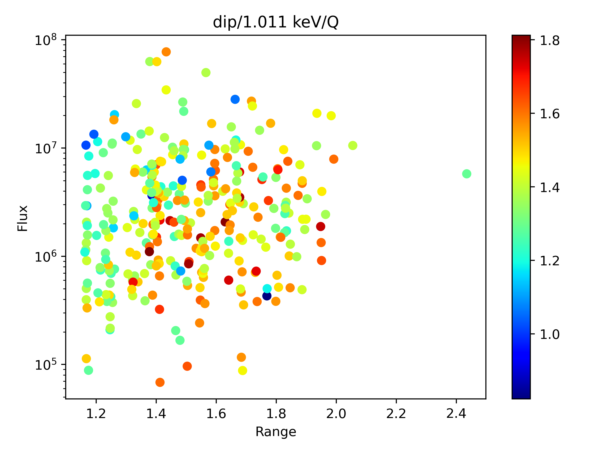
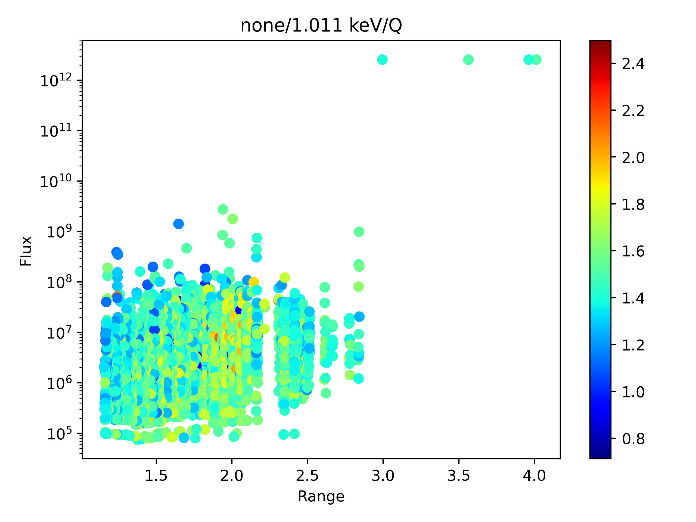
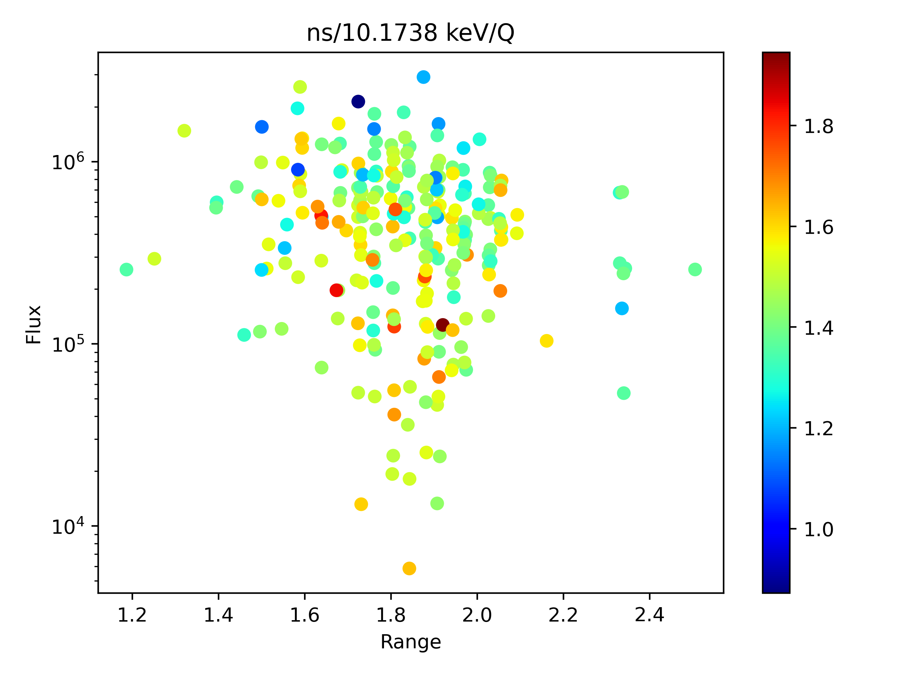
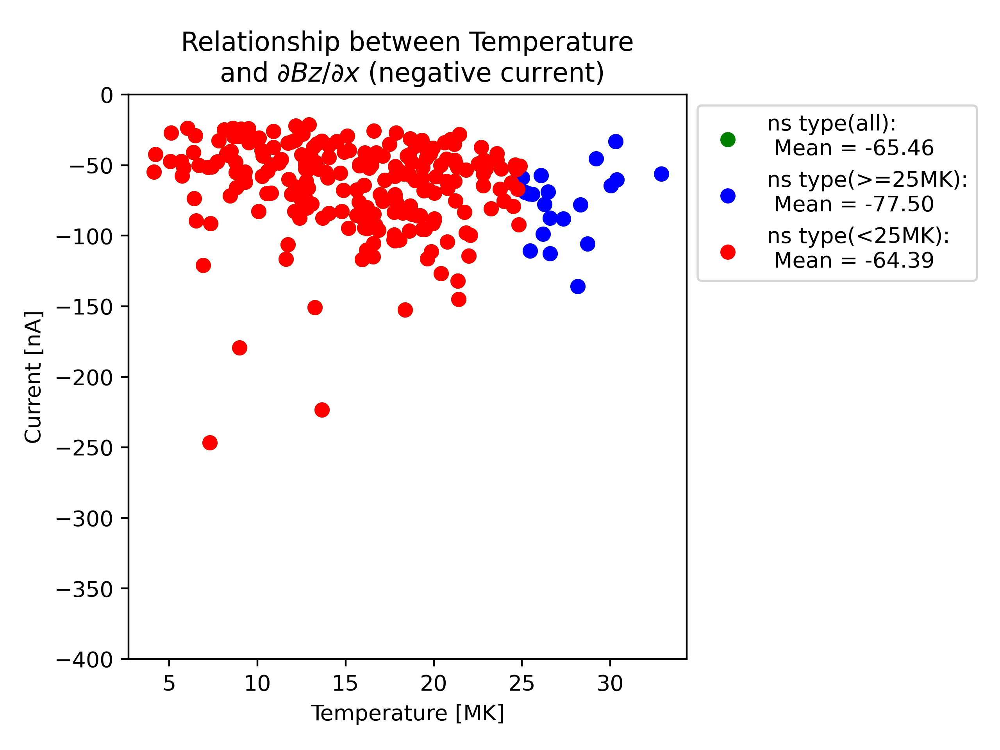
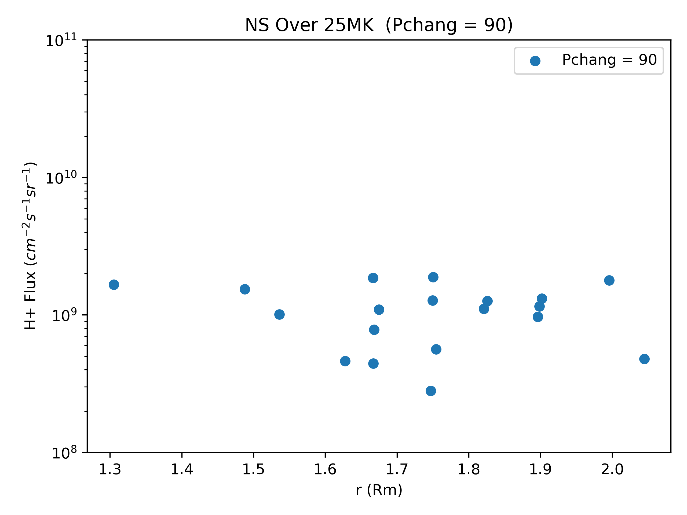

# 研究ノート
## 目次
- [目次](#目次)
- [関連ファイル](#関連ファイル)
- [2024/08/25](#20240825)
- [2024/08/27](#20240827)
- [2024/08/28](#20240828)
- [2024/09/09](#20240909)
- [2024/09/20](#20240920)
- [2024/09/27](#20240927)
- [2024/10/09](#20241009)
- [2024/10/11](#20241011)
- [2024/10/24](#20241024)

## 関連ファイル
* __MDUS__  
    MESSENGERのデータ利用を容易にするツール     
    ```https://github.com/streamamz/MDUS.git```
* 

## 2024/08/25
### 研究内容
進捗無し
### 作業概要
* 環境構築を行った
  * __MDUS__ モジュールのGitHubへのアップロード
  * __Research__ リポジトリの作成
### 作業ファイル
* __MDUS__ モジュール   
  データ読み込み用のモジュールをMDUSに一本化

## 2024/08/27
### 研究内容
dipタイプとtail currentタイプの違いが何によるのかの考察中   
とりあえずdipタイプについて，199（dipあり）と200（dipなし）の比較をしてみる   
その最中にMDUSの修正を行った
### 作業内容
* 200（dipなし）において，磁気赤道近辺での磁場成分の様子を確認する準備を行った
* MDUSモジュールを研究用にアップデートした
### 今後の予定
* dipタイプ，tail currentタイプともに磁気赤道近辺での磁場成分の様子の比較
  * tail currentタイプの，条件が近くdepressionがないものを見つける
  * Bz成分の変化の比較方法の考案
    * 単純に全体の時間変動だけではうまい定義ではない
* 連続してdipが確認されたときのRssを抽出して比較
  * Rssを使うべきかDistIndexを使うべきかの議論
    * DistIndexが近似式では不十分？
* MDUSのアップデート
  * データ解析用のツール開発
    * MLAT計算用ツールや時間平均計算用ツールなど
### 作業ファイル
* __MDUS__ モジュール   
  * dataファイルが使用しやすいように変更
  * 座標をRmで規格化できるように変更
* __TypeClassification__
  * 磁場成分からのdip生成の要因を考察するために利用
* __DataShaping__
  * dataファイルをpickle形式に書き換えるために利用
* __ModuleDevelop__
  * __MDUS__ 開発状況の確認に利用
  
## 2024/08/28
### 研究内容
dipタイプについてある場合とない場合についての比較を行った   
dipありとして199，52，なしとして200，54を利用
* 磁場最大値
  * 199 (dipあり) : 72.3
  * 200 (dipなし) : 107
  * 52 (dipあり) : 90.4
  * 54 (dipなし) : 86.2
* 磁場最小値
  * 199 (dipあり) : 5.49
  * 200 (dipなし) : 44.2
  * 52 (dipあり) : 15.9
  * 54 (dipなし) : 24.9
  
各タイプの図は以下の通り
<figure>


</figure>
<figure>


</figure>

tail currentタイプについてある場合とない場合についての比較を行った
dipありとして2048，なしとして2047を利用
* 磁場最大値
  * 2048 (tcなし) : 20.4
  * 2047 (tcなし) : 28.5
* 磁場最小値
  * 2048 (tcなし) : 3.90
  * 2047 (tcなし) : 23.7

それぞれ以下の通り

<figure>


</figure>

→磁場の最大値・最小値の比較は（特に窪み無しが）領域に依存するので意味がない   
時間変動で考える

磁場最大値から磁場最小値への変動の時間依存，磁場最小値が領域のどのあたりで起きるのかを比較してみる

dipタイプについて
| |時間変動（nt/sec） | 秒数 (sec) |
|---|---|---|
|52 (dipあり)|-0.166|450|
|54 (dipなし)|-0.102|600|
|199 (dipあり)|-0.171|390|
|200 (dipなし)|-0.118|530|

tcタイプについて
| |時間変動（nt/sec） | 秒数 (sec) |
|---|---|---|
|2048 (tcあり)|-0.0359|460|
|2047 (tcなし)|-0.0115|420|

図からもわかることだが，dipタイプはdipありとなしでBz成分の変化の様子が大きく異なっている    
その様子が時間変動・継続時間にも表れている

一方のtcタイプは，図からもわかることだが，Bzの変化の様子は大きくは異なっていなさそう？    
時間変動と秒数にも表れていそうだが，時間変動はそもそものBzの大きさにも依存するため，何らかの規格化しなければ比較にならなそう？

数値的に特徴を表すための工夫が必要

そもそもtcタイプの抽出が甘すぎるため，修正したい
←モデルを使えるように実装する必要あり

### 作業内容
* 各タイプに対して，窪みを抽出したものとそうでないものの比較を行った
* MDUSモジュールに研究用のアップデートを行った
### 今後の予定
* MDUSにモデル磁場計算用のツールを追加する
* Bz成分の評価の再考
  * その他の成分についても同様に見てみる
* 主にdipタイプにたいして，連続で生じているものを抽出してみる
* 新しく窪みの抽出方法を考案する
### 作業ファイル
* __MDUS__ モジュール
  * データ解析用のサブモジュール __Analysis__ を追加
* __TypeClassification__
  * 先述の作業を行うコードを記述
* __figure__
  * 複数ファイルを追加
  
## 2024/09/09
### 研究内容
粒子データを用いた研究をスタートさせる    
とりあえずdiamagnetic currentの計算からスタートしてみる
### 作業内容
Scanデータを利用できるようにMDUSを準備    
データファイルの成型なども行った
### 今後の予定
diamagnetic currentを計算できるように準備，過去のモジュールと計算結果が一致するか（先行研究も）比較する
### 作業ファイル
複数ファイルにわたるため割愛

## 2024/09/20
### 研究内容
fluxとdepressionの関係の考察を行った

作業仮説として
* 低エネルギーのFluxはNeutral Sheetに原因がある   
→低エネルギーのFluxはdepressionの有無・タイプに依らずに常に同じようにあるはず
* 高エネルギーのFluxはdip（Ring Current？）タイプに関係がある   
→dipタイプでみられるはず
* 低エネルギーfluxは距離に依存せずに広く分布しているはず
* 高エネルギーfluxは近距離にのみあるはず
* 太陽風とfluxの関係も見られたらうれしい

#### 低エネルギーについて
1keVの場合，以下のようになった
<figure>


</figure>
各タイプでほとんど違いはないといえそう？→neutral sheetの影響（？）は全領域でそれなりに効いていそう？

また，dipタイプとnsタイプの分布の違いは以下の様
<figure>



</figure>

~~Neutral Sheetタイプのほうがfluxが強い？→neutral sheetの影響を強く受けている？~~ 


#### 高エネルギーについて
10keVの場合以下の様になった
<figure>


</figure>
dipタイプのほうがfluxが強い→内側では強いfluxを持つ構造が存在している証左？

また，dipタイプとnsタイプの分布の違いは以下の様
<figure>



</figure>

~~はっきりとはわからないが，dipタイプのほうが強いfluxが多い？（あまり確信をもっては言えなさそう...）~~    
違いはほとんどないとしか言えなさそう...

#### まとめ
* 作業仮説の初めの2つはある程度は言えそう？
* NSタイプでも高エネルギーでfluxがあるものがある  
→Ring currentの影響が外側まで来ている？ 
→電流で分類したときにはBxが主要因だったはずなのに？ 
→中間領域だったのかも...それともほかの要因での高エネルギー？
* dipタイプでBzが重要なのに高エネルギーのfluxがないものは何？(orbit 199とorbit 201の違いは？)
* 太陽風との相関は言えなさそう...   
→depressionの深さの評価の時と同じく，うまく出来ないのでは？

depressionの磁場成分だけでなく，Fluxのエネルギーも使って，4通りに分類する必要あり？

**参考**
<figure>


</figure>

### 作業内容
省略
### 今後の予定
### 作業ファイル

## 2024/09/27
### 研究内容
前回の話：fluxではなくて温度でも同様の議論ができるのでは？

各タイプの温度をfluxのデータから計算してみる    
以下が結果
<figure>


</figure>

平均的にはdipタイプのほうが温度が高い   
が，これは先行研究の結果と同じ？（水星近傍のほうが高温のprotonがある（Zhao et al., 2020））   

* dipタイプは水星近傍で観測→温度が高い
* tcタイプは水星から離れた領域で観測→温度が低い

なだけなのでは？


温度のデータで今までの議論が出来るのか？

なお，orbit199（dipあり，高エネルギーあり）,200（dipなし，高エネルギーなし）,201（dipあり，高エネルギーなし）について，平均温度は以下の通り

* 199 : 25.0 MK
* 200 : 8.72 MK
* 201 : 9.53 MK

#### Fluxと温度の関係
dipタイプとtcタイプの温度の違いはfluxのどういう違いから生じるのか？

作業仮説として，dipタイプは高エネルギーのfluxが多いので...
* dipタイプは高エネルギーのfluxが多く温度が高くなる
* tcタイプは比較的温度の高いものでも高エネルギーのfluxは少なめ

みたいになっていると嬉しい

以下結果
<figure>


</figure>

温度が高いものでは高エネルギーのfluxが多く，低温では低エネルギーが多いという傾向はある（自明な気もするが...）

dipタイプとtcタイプで大きな違いがあるようには見えない...

一方で，dipタイプでは25 MK以上があるが，tcタイプでは25 MK程度からほとんどなくなってくる．この違いは？

### 作業内容
### 今後の予定
温度について，dipタイプではnsタイプでみられない温度の”山”がある（25MK以上）   
これが空間的にどのような場所で生じているのか（朝夕非対称があるのか）などの議論をしてみる

温度と電流$(\nabla\times B)$との相関をとってみる（磁場の深さでの議論はモデル磁場の評価になってしまうため）

各タイプについて，plasma beta，磁気圧，protonの圧力でDeweyの様な図を作ってみる（太陽風以外，tailのほうにも原因を探ってみる）

高温を典型的なdipとして取り出して議論

$grad P$のｘ成分が強いほど高温なものがみられる？（空間スケールか温度か）

* 温度が強い→dipが強い
* gradPが強い→dipが強い
  
みたいなタイプがあるのかも...

gradPの定義→peak-to-peakで定義？    
peakの点での傾きを見てみる  
(次元解析的にＰ/Lで特徴的な空間スケールとしてのLxを計算してみる（East,Westいずれも）)
L：特徴的な空間スケール

これらを使って，Jy_dip，Lx，Pの分布をみてみる   
そこから分類，特徴を見てみる
### 作業ファイル

## 2024/10/09
### 研究内容
#### 前回のまとめ
**dipタイプはnsタイプと比較して高温な成分を持っている．特に>=25MKあたりに一つ"山"がある** 

以下の様なアプローチでこれについて考えていく
1. 特にdipタイプの高温のものについて，南北非対称性があるのか
   * plasma sheetについては朝方側がより水星側に張り出している（Dewey et al., 2020）
   * 温度に関しても朝方側が高温（Zhao et al., 2020） 
2. 温度の高さと$\nabla\times B$の大きさには何らかの相関があるのか
   * 高温のプラズマがあるほど強い電流が流れるのか
3. 圧力勾配（$\nabla P$）と温度に関係はあるのか
   * 温度だけでなく，圧力に依存したdepressionもあるのかも...
4. 尾部領域にも原因の探索をしてみる
   * $\beta$や磁気圧，プラズマ圧との関係をDewey et al., 2020のように作ってみる
  
#### 結果
それぞれの結果をまとめていく
##### 1．朝夕非対称について
dipタイプについて，25MK以上になっているものは82で，全体の約4分の1程度（全体は）

以下が結果の図になる
<figure>


</figure>

* 朝夕非対称に関してははっきりと何かを言うのは難しそう...?
* nsタイプに関して，抽出したものはむしろdusk側に偏っていそう？
  
#### 2．rotB電流との相関について
$J_Y = (\nabla\times B)_Y =\partial B_X/\partial Z-\partial B_Z/\partial X$と温度の関係を考える．

このときに，dipタイプ，nsタイプについて，$J_Y$，$\partial B_X/\partial Z$，$-\partial B_Z/\partial X$それぞれとの関係をプロット

以下結果
<figure>


</figure>
<figure>


</figure>
<figure>


</figure>
<figure>


</figure>
<figure>


</figure>
<figure>


</figure>

表にすると...
* $J_Y$について
  
  | |positive|negative|
  |--|--|--|
  |dip(all)|188.5|-130.01|
  |dip(>=25MK)|210.51|-153.16|
  |dip(<25MK)|180.14|-121.39|
  |ns(all)|161.47|-48.25|
  |ns(>=25MK)|172.24|-46.02|
  |ns(<25MK)|160.51|-48.44|

* $\partial B_Z/\partial X$について

  | |positive|negative|
  |--|--|--|
  |dip(all)|133.55|-146.36|
  |dip(>=25MK)|157.36|-169.59|
  |dip(<25MK)|124.74|-137.78|
  |ns(all)|52.04|-65.46|
  |ns(>=25MK)|52.51|-77.50|
  |ns(<25MK)|52.00|-64.39|

* $\partial B_X/\partial Z$について

  | |positive|negative|
  |--|--|--|
  |dip(all)|81.62|-33.05|
  |dip(>=25MK)|88.60|-32.65|
  |dip(<25MK)|79.19|-33.19|
  |ns(all)|127.38|-28.33|
  |ns(>=25MK)|132.15|-21.57|
  |ns(<25MK)|129.96|-28.93|

雑感として

* dipタイプに関してはいずれの電流についても，温度が高くなるほうが強くなる傾向あり
  * 主要な成分と，それから外れた雑多なものに分類できそう    
  →雑多なほうに関しては，電流の計算に依っていそう？
* nsタイプに関してはいずれの電流についても，温度と明確な関係はみられなさそう
  * $\partial B_X/\partial Z$のnegative（dawn-to-dusk）方向の電流が小さくほとんど変化がないのは，neutral sheet通過したこととconsistentな結果といえそう
* dipタイプのほうがnsタイプより$\partial B_Z/\partial X$成分が電流強い    
→ここまでの過程に一致していそう

以上より，

* 温度の高いプラズマのある領域でより強い電流が流れている
* dawn-to-duskの電流はdipタイプで強く流れる

ことは言えそう

#### ３．圧力勾配について
コードに問題があったため修正中←完了

### 作業内容

### 今後の予定
#### 技術面
* ```MoveAverage```が正しく動いている？要確認←対応完了
* pitch角について取り扱えるようにする
  * そもそもどのデータなのかも確認

### 作業ファイル
* ```DipLocationWithPhysParm```：１，２関連の作業
* ```RelationGradP```：３関連の作業
* ```CalcPlasmaBeta```：４関連の作業

## 2024/10/11
### 研究内容
#### 研究目的
**dipの成因は何なのか**を知りたい

そのために
1. 電流に注目してどのような電流が窪みを作っているのかを考える
2. 太陽風動圧に注目してどのような条件下で生じるのかを考える

を主に行ってきた

##### １について
双極子磁場（モデル磁場）と観測磁場の差分をとって$\nabla\times B$を計算して電流成分を考えてきた

先行研究では窪み構造はplasma sheetによるものとされてきた．本領域には西向きの電流（current sheet）が存在

一方で計算結果として東向きの電流も確認できた．

これら二つの電流をどのように区別するのか，プラズマに注目したときにどのような条件で生じるのかを考えていきたい

* 水星からの距離（真夜中の場合x座標）とJyの関係を考えてみる
  * 距離が離れるとcurrent sheetの影響が出てくるならば距離に依存して電流の様子が変わる？
* プラズマとの関係を考えてみる
  * ピッチ角でみたときに，典型的なdipタイプでは90度近辺に集中したfluxが見えている？
  * pressure gradientが重要になるならば圧力との関係も見ていきたい

#### Pitch Angleについて
MESSENGER観測データからピッチ角の様子を確認してみる

使用したデータは```MESSENGER EPPS FIPS Derived Pitch Angle Distributions Data Collection```

参考までに，orbit:199, 200, 201について


tcタイプについても同様に，orbit：2047，2048について


はっきりと「ピッチ角90度に強いfluxがあるからring currentだ」とは言えなさそう...?

* 199（dipタイプ）：たしかに90度を中心とした領域にfluxあり．ただし，観測されていない領域もあるし，全体に幅広にfluxがあるため，ring currentだと言えなさそう...
* 200（なし）：ピッチ角が<90度の領域は視野がないが，全体的に幅広．とはいえ，90度のあたりの領域に最も強いfluxあるか...
* 201（あり）：200に同じ．プラズマ的に似た特徴なのにdipの有無が生じるのはなぜ？
* 2047（tcなし）：視野角の制限があるため何とも言えないが，pitch角90度より大きいものが多い？
* 2048（tcあり）：90度前後に集中？

### 作業内容
### 今後の予定
### 作業ファイル

## 2024/10/24
### 研究内容
#### 前回のまとめ
ピッチ角についてのデータを見てみた
* dipタイプ（高温）：90度あたりにそれなりのフラックスあり？
* 水星近傍（低温）：90度に明確に強いフラックスあり
* nsタイプ：全体的に幅広に分布
  
のようになっていた．ピッチ角の異方性についての議論をしていきたい

#### 結果
そもそもどうやって異方性を議論するべきか...
* 空間分布をみてみる
  * XY空間でみてみる
  * R依存性を見てみる
* 頻度をみてみる
  * 各タイプに対して，それぞれのピッチ角のフラックスがどうなっているのかを見てみる
  
作業仮説的には...
* 水星近傍のものでは90度近辺でのフラックスが顕著に強くなっている
  * 低温に関してはそれがどのエネルギー帯によるものなのかまでは議論をするのは難しい
* 尾部のものでは，ピッチ角に対して依存がほとんどない
  
これが言えれば近くのものがRing Currentによるものであると言える...?

#### ピッチ角とフラックスの関係
以下がピッチ角と平均フラックスの関係の図


以下雑感
* 低温のほうがフラックスが多い傾向あり
  * 高エネルギーについては観測されていないから？
* dipタイプについては90度のあたりにピーク有
  * Ring Currentを反映？
* nsタイプについて
  * 低温：フラックスの変化はあまりないが，170度が以上に高い
    * 視野の関係？確かにシールドに対して後ろからのフラックスは観測しやすそうだが，それなら10度のほうもフラックスが強くてもいいのでは？
      * 観測機器について調べる必要あり
    * 外れ値の影響かも
  * 高温：多少90度あたりに強いフラックスがあるか？
    * ただし，そもそも観測数が非常に少ない
    * こちらも170度あたりでフラックスが強くなっている
  
これらより
* 水星近傍ではたしかに90度あたりのフラックスが強くなっていそう
  * Ring Currentの証左といえる？
* 高温のものでも90度あたりでフラックスが強くなっていそう？
  * サンプル数が少ないからか？
  * 高温のものはRing Current以外の何らかの構造が影響しているから？
  
代表例として，ピッチ角90度のものを各タイプ貼っておく


#### 空間依存
どこでどれくらいフラックスが強くなっているのか
##### Rとの関係
特に90度に対して





磁気赤道からの距離でははっきりと何かを言うのは難しそう...

##### XY空間での関係
同様に，XY平面での関係をプロット    
以下は代表例として90度について


何ともはっきり言えなさそう...
* 観測できていたか否かが観測領域に依存するはず
* 同じような場所で値が大きく違うのは，他の原因（例えば太陽風？）などによっている？
### 作業内容
### 今後の予定
### 作業ファイル